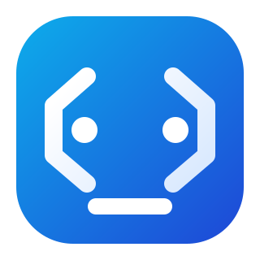

<div align="center">
  
  <h1>Codions MVP</h1>
  <p>
    <strong>An unattended coding agent that turns task descriptions into GitHub Pull Requests — powered by local LLMs.</strong>
  </p>
  <p>
    Inspired by <a href="https://stripe.dev/blog/minions-stripes-one-shot-end-to-end-coding-agents">Minions: Stripe's one-shot end-to-end coding agents</a> by Stripe.
  </p>
  <p>
    <a href="#quick-start">Quick Start</a> &bull;
    <a href="#architecture">Architecture</a> &bull;
    <a href="#features">Features</a> &bull;
    <a href="#project-structure">Project Structure</a> &bull;
    <a href="#configuration">Configuration</a> &bull;
    <a href="#google-chat-integration">Google Chat</a>
  </p>
</div>

<br/>

<p align="center">
  
  
  
  
  
</p>

---

## What is Codions?

Codions is an automated coding agent system. You describe a task — fix a bug, add a feature, update documentation — and Codions:

1. **Clones** the target repository into an isolated Docker container
2. **Generates** code changes using a local LLM via [Ollama](https://ollama.com) (no data leaves your machine)
3. **Validates** changes through deterministic gates (format, build, test)
4. **Opens a Pull Request** on GitHub with the results

No cloud API keys. No token costs. Fully self-hosted.

---

## Architecture

```
                    ┌──────────────────┐     ┌──────────────────┐
                    │   REST Client    │     │   Google Chat    │
                    └────────┬─────────┘     └────────┬─────────┘
                             │                        │
                             ▼                        ▼
                    ┌─────────────────┐     ┌──────────────────┐
                    │  Codions.Api    │◄────│ Codions.Chat     │
                    │  (port 5005)    │     │ Adapter (5006)   │
                    └────────┬────────┘     └──────────────────┘
                             │
                    ┌────────▼────────┐
                    │  Orchestrator   │  normalize → context → model tier
                    └────────┬────────┘
                             │
                    ┌────────▼────────┐
                    │   SQL Server    │  persist job state & artifacts
                    └────────┬────────┘
                             │
                    ┌────────▼────────┐
                    │ Codions.Worker  │  background service polling for jobs
                    └────────┬────────┘
                             │
              ┌──────────────▼──────────────┐
              │   Ephemeral Docker Container │
              │  ┌────────────────────────┐  │
              │  │  Codions.BotHarness    │  │
              │  │  ┌──────────────────┐  │  │
              │  │  │   Agent Loop     │──┼──┼──► Ollama (local LLM)
              │  │  │  code generation │  │  │
              │  │  └──────┬───────────┘  │  │
              │  │         ▼              │  │
              │  │  ┌──────────────────┐  │  │
              │  │  │  Gates: format,  │  │  │
              │  │  │  build, test     │  │  │
              │  │  └──────┬───────────┘  │  │
              │  │         ▼              │  │
              │  │  ┌──────────────────┐  │  │
              │  │  │  Git push + PR   │──┼──┼──► GitHub
              │  │  └──────────────────┘  │  │
              │  └────────────────────────┘  │
              └──────────────────────────────┘
```

---

## Features

### Intelligent Model Routing

Tasks are automatically routed to the right-sized model based on complexity:

| Tier | Typical Model | Use Case |
|------|--------------|----------|
| **Cheap** | `qwen2.5-coder:7b` | Docs, typos, simple renames |
| **Balanced** | `qwen2.5-coder:14b` | General tasks (default) |
| **Strong** | `qwen2.5-coder:32b` | Refactors, security, architecture |

### Isolated Execution

Every job runs inside an **ephemeral Docker container** with:
- Non-root user (`botuser`)
- Resource limits (memory & CPU caps)
- Network isolation (no egress by default)
- Path validation to prevent traversal attacks

### Deterministic Quality Gates

Pull Requests are only created when **all gates pass**:
- **Format** — `dotnet format` (or repo-specific)
- **Build** — `dotnet build -c Release` (or repo-specific)
- **Test** — targeted or full test suite

### Fully Local LLM Inference

All code generation happens through [Ollama](https://ollama.com) running on your machine. **No data is sent to external APIs.** No token usage costs.

### Security-First Design

- Tokens injected via environment variables, never written to logs
- Log output automatically redacted for known token patterns
- Disallowed paths enforced by the agent loop
- Audit trail per job (requester, repo, branch, PR URL, timestamps)

---

## Quick Start

### Prerequisites

| Requirement | Notes |
|---|---|
| [.NET 10 SDK](https://dotnet.microsoft.com/download) | All projects target `net10.0` |
| [Docker Desktop](https://www.docker.com/products/docker-desktop/) or Docker Engine + Compose | Required for bot containers, SQL Server, and (recommended) Ollama runtime |
| [Ollama](https://ollama.com) (optional) | Only needed if you run Ollama on the host instead of Docker Compose |
| GitHub PAT | Personal access token with `repo` scope |

### 1. Build the bot Docker image

```bash
docker build -t codions-bot:latest -f docker/bot/Dockerfile .
```

### 2. Configure secrets

Copy `.env` for Docker Compose variables:

```bash
cp .env.example .env
```

```dotenv
SA_PASSWORD=YourStr0ng!Pass      # SQL Server (8+ chars, upper, lower, digit, symbol)
GITHUB_TOKEN=ghp_your_token      # Optional placeholder in this file
GOOGLE_CHAT_VERIFICATION_TOKEN=  # Optional placeholder in this file
```

Set runtime config for API/Worker in your shell (or via User Secrets):

```bash
export GitHub__Token=ghp_your_token_here
```

### 3. Start infrastructure

```bash
docker compose up -d sqlserver ollama
```

Wait for the SQL Server health check to pass (`docker compose ps`).

### 4. Pull the LLM models

```bash
docker compose run --rm ollama-pull
```

> Host Ollama alternative: run `ollama pull qwen2.5-coder:7b`, `ollama pull qwen2.5-coder:14b`, and `ollama pull qwen2.5-coder:32b`.
>
> If you use host Ollama, bot containers call `http://host.docker.internal:11434` (works out of the box on Docker Desktop for macOS/Windows). On Linux, prefer Dockerized Ollama, or set a reachable `Ollama__BaseUrl` for containers.

### 5. Run the API & Worker

```bash
# Terminal 1 — API (port 5005)
cd src/Codions.Api
dotnet run

# Terminal 2 — Worker
cd src/Codions.Worker
dotnet run
```

### 6. Submit a job

```bash
curl -X POST http://localhost:5005/api/jobs \
  -H "Content-Type: application/json" \
  -d '{
    "source": "cli",
    "requester": { "id": "u1", "displayName": "Developer" },
    "repo": {
      "provider": "GitHub",
      "owner": "your-org",
      "name": "your-repo",
      "cloneUrl": "https://github.com/your-org/your-repo.git",
      "defaultBranch": "main"
    },
    "task": {
      "title": "Fix failing test",
      "description": "TestX fails with NullReferenceException. Fix it.",
      "acceptanceCriteria": ["dotnet test tests/Foo.Tests passes"],
      "scopeHints": ["src/Foo", "tests/Foo.Tests"]
    },
    "preferences": {
      "priority": "Normal",
      "modelHint": "balanced",
      "maxMinutes": 25
    }
  }'
```

### 7. Check status & logs

```bash
curl http://localhost:5005/api/jobs/{jobId}
curl http://localhost:5005/api/jobs/{jobId}/logs
```

---

## Running with Docker Compose

Docker Compose runs **SQL Server** and **Ollama** (and can build the bot image). The API, Worker, and Chat Adapter run locally via `dotnet run` (see Quick Start).

```bash
# Start SQL Server and Ollama
docker compose up -d sqlserver ollama

# Optional: build the bot image (required for job execution)
docker compose --profile build build codions-bot
```

To pull the LLM models when using Ollama in Docker, run once:

```bash
docker compose run --rm ollama-pull
```

If you run Ollama on the host instead of Docker Compose:

```bash
ollama pull qwen2.5-coder:7b
ollama pull qwen2.5-coder:14b
ollama pull qwen2.5-coder:32b
```

---

## Project Structure

```
Codions MVP/
├── src/
│   ├── Codions.Api/              # REST API gateway (ASP.NET Core)
│   ├── Codions.BotHarness/       # Console app running inside Docker containers
│   ├── Codions.ChatAdapter/      # Google Chat webhook adapter
│   ├── Codions.Contracts/        # Shared DTOs, enums, interfaces
│   ├── Codions.Core/             # Orchestration, model routing, context building
│   ├── Codions.Infrastructure/   # EF Core, Docker, GitHub, Ollama integrations
│   └── Codions.Worker/           # Background job processor
├── docker/
│   └── bot/                      # Bot container Dockerfile
├── data/                         # Runtime data (workspaces, artifacts)
├── docs/                         # Additional documentation
├── docker-compose.yml
└── .env.example
```

| Project | Responsibility |
|---------|---------------|
| **Codions.Api** | REST API gateway — job creation, status queries |
| **Codions.Worker** | Background service — polls for queued jobs, orchestrates containers |
| **Codions.BotHarness** | Runs inside containers — agent loop, git operations, PR creation |
| **Codions.Core** | Business logic — orchestration, model tier routing, context building |
| **Codions.Infrastructure** | Integrations — database, Docker, GitHub API, Ollama client |
| **Codions.Contracts** | Shared types — models, interfaces, enums used across projects |
| **Codions.ChatAdapter** | Google Chat webhook handler — translates messages into API calls |

---

## Configuration

### `appsettings.json` (Api & Worker, example)

```jsonc
{
  "ConnectionStrings": {
    "DefaultConnection": "Server=localhost,1433;Database=Codions;..."
  },
  "Docker": {
    "BotImage": "codions-bot:latest",
    "WorkspacesPath": "data/workspaces",
    "MemoryLimitMb": 2048,
    "CpuLimit": 2.0
  },
  "Ollama": {
    "BaseUrl": "http://localhost:11434",
    "Models": {
      "Cheap": "qwen2.5-coder:7b",
      "Balanced": "qwen2.5-coder:14b",
      "Strong": "qwen2.5-coder:32b"
    }
  },
  "GitHub": {
    "Token": "ghp_..."
  },
  "Defaults": {
    "MaxAgentSteps": 16,
    "MaxWallClockMinutes": 25,
    "MaxFixAttempts": 2,
    "MaxTestMinutes": 15
  }
}
```

### Environment Variables

All config values can be overridden via environment variables using `__` as separator:

```bash
Ollama__BaseUrl=http://localhost:11434
GitHub__Token=ghp_your_token
GitHub__DefaultBranch=main
Docker__MemoryLimitMb=4096
```

---

## Google Chat Integration

Codions can receive tasks directly from **Google Chat** via a webhook adapter.

1. Start the API and Chat Adapter:
   ```bash
   # Terminal 1
   cd src/Codions.Api && dotnet run

   # Terminal 2
   cd src/Codions.ChatAdapter && dotnet run
   ```

2. Expose the adapter publicly (Google must reach your `/webhook` endpoint):
   ```bash
   ngrok http 5006
   ```

3. Configure the Google Chat app webhook URL to:
   ```
   https://<your-public-host>/webhook
   ```

4. Configure Chat Adapter defaults in `src/Codions.ChatAdapter/appsettings.json`:
   - `GoogleChat:VerificationToken` (optional) for request verification.
   - `GitHub:DefaultBranch` (runtime default is `master`) used when creating job requests from chat.
     If your repos use `main`, set it to `main`.

See [`docs/google-chat-setup.md`](docs/google-chat-setup.md) for the full setup guide.

---

## How It Works

```
1. Client submits a task via REST API or Google Chat
2. Orchestrator normalizes the request and builds a context pack
3. Model tier router selects the right-sized LLM (cheap / balanced / strong)
4. Job is persisted to SQL Server with status "Queued"
5. Worker dequeues the job and spins up an ephemeral Docker container
6. BotHarness (inside the container) clones the repo and creates a branch
7. Agent loop iteratively calls Ollama to generate code changes
8. Changes are applied, then validated through format → build → test gates
9. If all gates pass: commit, push, and create a Pull Request
10. Worker collects results, updates job status, and logs an audit entry
```

---

## Tech Stack

| Layer | Technology |
|-------|-----------|
| **Runtime** | .NET 10 / C# |
| **API Framework** | ASP.NET Core |
| **Database** | SQL Server 2022 (via EF Core) |
| **Containers** | Docker (via Docker.DotNet) |
| **LLM Inference** | Ollama (local, no cloud) |
| **GitHub** | Octokit .NET |
| **Messaging** | Google Chat Webhooks |

---

## License

This project is licensed under the [MIT License](LICENSE).
